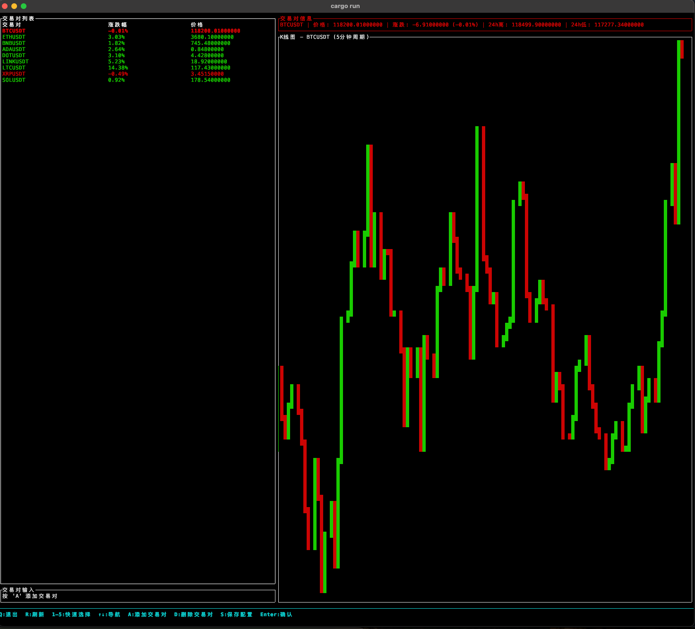

# Binance Portal TUI

一个基于 Rust 和 ratatui 构建的币安行情 TUI 应用。



## 功能特性


- 实时显示币安交易对价格和涨跌幅
- 5分钟周期 K 线图显示，包含交易对名称和详细信息
- 左侧交易对表格（交易对名、涨跌幅、价格），右侧 K 线图布局
- 每20秒自动刷新数据
- 支持键盘导航选择交易对
- 自动保存自定义交易对到配置文件

## 安装和运行

```bash
# 克隆项目
git clone <repository-url>
cd binance-portal-tui

# 编译和运行
cargo run
```

## 键盘控制

### 正常模式
- `q` - 退出应用
- `r` 或 `空格` - 手动刷新数据
- `1-5` - 快速选择前5个交易对
- `↑/↓` - 上下导航选择交易对
- `a` - 进入添加交易对输入模式
- `d` - 删除当前选中的自定义交易对
- `s` - 手动保存配置

### 输入模式（添加交易对时）
- 输入字母数字字符 - 添加到输入缓冲区
- `Backspace` - 删除最后一个字符
- `Enter` - 确认添加交易对
- `Esc` - 取消输入并返回正常模式

应用底部会显示所有可用的按键说明。

## 配置

应用会自动创建配置文件，默认位置：
- macOS: `~/Library/Application Support/binance-portal-tui/config.toml`
- Linux: `~/.config/binance-portal-tui/config.toml`

### 配置文件结构
```toml
refresh_interval = 20
binance_api_url = "https://api.binance.com"

[theme]
primary = "#00ff00"
secondary = "#ffff00"
background = "#000000"
text = "#ffffff"

[trading_pairs]
# 默认交易对列表
default_pairs = ["BTCUSDT", "ETHUSDT", "BNBUSDT", "ADAUSDT", "DOTUSDT", "LINKUSDT", "LTCUSDT", "XRPUSDT"]
# 自定义交易对列表（用户添加的会保存在这里）
custom_pairs = []
# 最大显示交易对数量
max_display_pairs = 20
```

### 保存功能
- **自动保存**：添加或删除交易对时会自动保存到配置文件
- **手动保存**：按 `S` 键可以手动保存当前配置
- **持久化**：重启应用后自定义交易对会保持不变

## 技术栈

- **Rust** - 编程语言
- **ratatui** - TUI 框架
- **crossterm** - 终端控制
- **reqwest** - HTTP 客户端
- **tokio** - 异步运行时
- **serde** - 序列化/反序列化

## 项目结构

```
src/
├── main.rs      # 主入口
├── app.rs       # 应用状态管理
├── api.rs       # Binance API 接口
├── config.rs    # 配置管理
├── event.rs     # 事件处理
└── ui.rs        # UI 绘制
```

## 开发

```bash
# 检查代码
cargo check

# 运行测试
cargo test

# 构建发布版本
cargo build --release
``` 